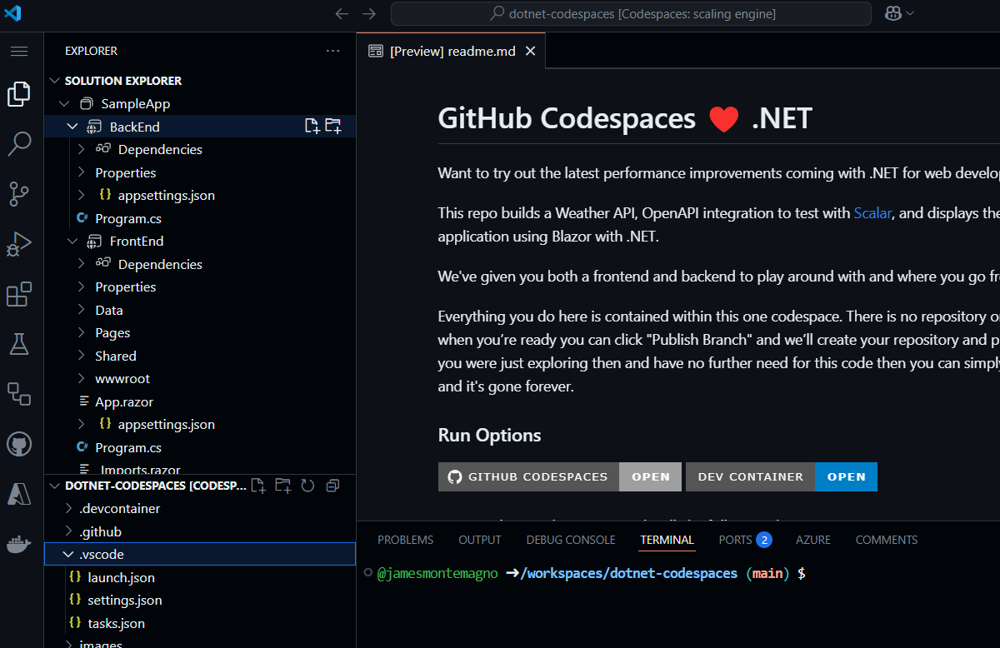
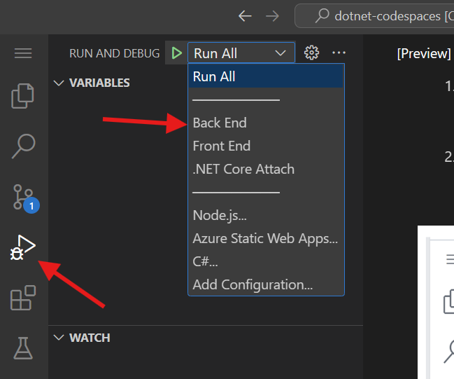
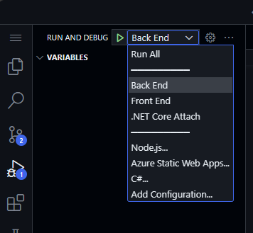
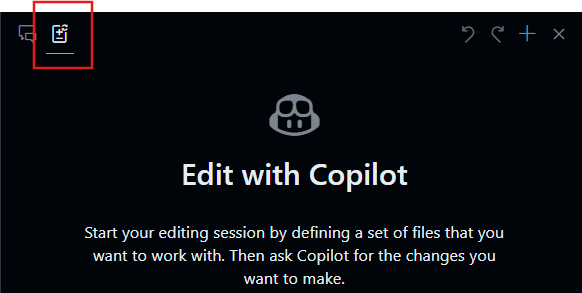
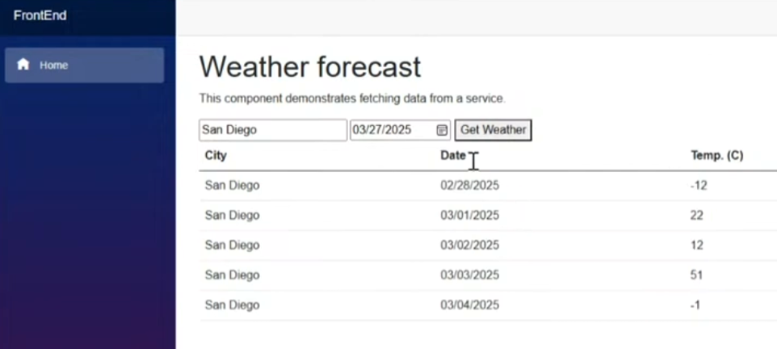

- **Pour qui** : Développeurs, ingénieurs DevOps, responsables du développement logiciel, testeurs.  
- **Ce que vous apprendrez** : Comment utiliser GitHub Copilot pour créer du code et ajouter des commentaires à votre travail.  
- **Ce que vous construirez** : Des fichiers C# contenant du code généré par Copilot AI pour des suggestions de code et de commentaires.  
- **Prérequis** : GitHub Copilot est disponible gratuitement, inscrivez-vous sur [GitHub Copilot](https://gh.io/copilot).  
- **Durée** : Ce cours peut être terminé en moins d'une heure.  

À la fin de ce module, vous aurez acquis les compétences nécessaires pour :  

- Rédiger des invites pour générer des suggestions avec GitHub Copilot.  
- Appliquer GitHub Copilot pour améliorer vos projets.  

## Lecture préalable :  
- [Introduction à l'ingénierie des invites avec GitHub Copilot](https://learn.microsoft.com/training/modules/introduction-prompt-engineering-with-github-copilot)  

- [Qu'est-ce que l'extension GitHub Copilot pour Visual Studio ?](https://learn.microsoft.com/en-us/visualstudio/ide/visual-studio-github-copilot-extension?view=vs-2022)  

## Pré-requis  

1. Activez votre [service GitHub Copilot](https://github.com/github-copilot/signup).  

1. Familiarisez-vous avec [ce dépôt avec Codespaces](https://github.com/github/dotnet-codespaces).  

## 💪🏽 Exercice  

**Cliquez avec le bouton droit sur le bouton Codespaces suivant pour ouvrir votre Codespace dans un nouvel onglet**  

[](https://codespaces.new/github/dotnet-codespaces)  

Le dépôt "**GitHub Codespaces ♥️ .NET**" construit une API Météo en utilisant des API minimales, ouvre Swagger pour que vous puissiez appeler et tester l'API, et affiche les données dans une application web utilisant Blazor avec .NET.  

Nous allons examiner les étapes pour mettre à jour l'application Backend Météo en ajoutant un nouvel endpoint qui demande un emplacement spécifique et renvoie les prévisions météorologiques pour cet emplacement.  

### 🤔 Étape 0 : Familiarisez-vous avec le dépôt "GitHub Codespaces ♥️ .NET"  

Une fois que vous avez ouvert le dépôt dans Codespaces, vous verrez une nouvelle fenêtre de navigateur avec un Codespace entièrement fonctionnel. Tout dans ce dépôt est contenu dans ce seul Codespace. Par exemple, dans le panneau de l'explorateur, vous pouvez voir le code principal pour le projet Backend et le projet Frontend.  

  

Avant de lancer le projet, utilisons GitHub Copilot Chat pour en apprendre davantage sur ce que fait le projet et ses différents composants.  

1. Ouvrez **GitHub Copilot Chat** depuis la barre de navigation principale.  
1. Tapez `What is this project doing, and what are the key components?` et appuyez sur **Envoyer**.  

GitHub Copilot Chat analysera maintenant l'intégralité du projet et nous fournira un résumé de ce que font les projets, des technologies utilisées, et des composants clés.  

  

À partir de là, vous pouvez cliquer sur les fichiers pour naviguer dedans et poser des questions de suivi telles que `What APIs are available?`.  

### 🚀 Étape 1 : Exécutez les projets  

Maintenant que nous avons une idée de ce que contient le projet, exécutons-le pour le voir en action.  
Pour exécuter le projet Backend, allez dans le panneau "Run and Debug", et sélectionnez le projet "Backend".  

  

Démarrez le débogage du projet sélectionné. Le projet API Météo, notre projet Backend, sera maintenant en cours d'exécution sur le port 8080. Nous pouvons copier l'URL publiée depuis le panneau *Ports*.  

  

> Note : Lorsque vous exécutez l'application, vous verrez un message d'erreur "Cette page ne fonctionne pas". Cela est dû au fait que nous devons naviguer vers l'endpoint, qui est détaillé ci-dessous.  

L'application Backend a publié un endpoint nommé `weatherforecast` qui génère des données de prévisions aléatoires. Pour tester l'application en cours d'exécution, vous pouvez ajouter `/weatherforecast` à l'URL publiée. L'URL finale devrait ressembler à ceci :  

```bash
https://< your url>.app.github.dev/weatherforecast
```  
L'application en cours d'exécution dans un navigateur devrait ressembler à ceci :  

  

Ajoutons maintenant un point d'arrêt dans notre application pour déboguer chaque appel à l'API. Allez dans le fichier `Program.cs` file in the BackEnd project. The file is in the following path `SampleApp\BackEnd\Program.cs`. 

Add a breakpoint in line 24 (press F9) and refresh the browser with the Url to test the endpoint. The browser should not show the weather forecast, and in the Visual Studio Editor we can see how the program execution was paused at line 24.


Pressing F10 we can debug step-by-step until line 32, where we can see the generated values. The application should have been generated samples Weather values for the next 5 days. The variable `forecast` has an array containing these values.


You can stop debugging now.

Congratulations! Now you are ready to add more features into the app using GitHub Copilot.

### 🗒️ Step 2: Get familiarized with GitHub Copilot Slash Commands

As we start working in our codebase, we usually need to refactor some code, or get more context or explanations about it. Using GitHub Copilot Chat, we can have AI-driven conversations to perform these tasks. 

Open the file `Program.cs` in the BackEnd project. The file is in the following path `SampleApp\BackEnd\Program.cs`. 

Now let's use a slash command, in GitHub Copilot to understand a piece of code. Select lines 22-35, press `CTRL + I` to open the inline chat, and type `/explain`.  

  

En fonction de votre version de GitHub Copilot, vous verrez soit une réponse en ligne, soit une mise à jour dans le panneau de discussion. GitHub Copilot créera une explication détaillée du code sélectionné. Une version résumée ressemblera à ceci :  

```
The selected C# code is part of an ASP.NET Core application using the minimal API feature. It defines a GET endpoint at "/weatherforecast" that generates an array of WeatherForecast objects. Each object is created with a date, a random temperature, and a random summary. The endpoint is named "GetWeatherForecast" and has OpenAPI support for standardized API structure documentation.
```  

**Les commandes slash** sont des commandes spéciales que vous pouvez utiliser dans le chat pour effectuer des actions spécifiques sur votre code. Par exemple, vous pouvez utiliser :  
- `/doc` to add a documentation comment 
- `/explain` to explain the code 
- `/fix` to propose a fix for the problems in the selected code 
- `/generate` to generate code to answer your question

Let's use the `/tests` command to generate tests to the code. Select lines 39-42, press `CTRL + I` to open the inline chat, and type `/tests` (or select the /tests slash command) to generate a new set of tests for this record.


At this point, GitHub Copilot will suggest a new class. You need to first press [Accept] to create the new file. 

A new class `ProgramTests.cs` was created and added to the project. This tests are using XUnit, however, you can ask to generate tests using another Unit Test library with a command like this one `/tests use MSTests for unit testing`.

***Important:** We are not going to use the test file in this project. You must delete the generated test file to continue.*

Finally, let's use the `/doc` to generate automatic documentation to the code. Select lines 39-42, press `CTRL + I` to open the inline chat, and type `/doc` (or select the command) to generate the documentation for this record.


Inline chat, the Chat Panel, and slash commands are part of the amazing tools that support our development experience with GitHub Copilot. Now we are ready to add new features to this App.


### 🗒️ Step 3: Generate a new Record that includes the city name

Go to the `Program.cs` file in the BackEnd project. The file is in the following path `SampleApp\BackEnd\Program.cs`.  

  

Naviguez jusqu'à la fin du fichier et demandez à Copilot de générer un nouvel enregistrement qui inclut le nom de la ville.  

```csharp
// create a new internal record named WeatherForecastByCity that request the following parameters: City, Date, TemperatureC, Summary
```  

Le code généré devrait ressembler à ceci :  

```csharp
// create a new internal record named WeatherForecastByCity that request the following parameters: City, Date, TemperatureC, Summary
internal record WeatherForecastByCity(string City, DateOnly Date, int TemperatureC, string? Summary)
{
    public int TemperatureF => 32 + (int)(TemperatureC / 0.5556);
}
```  

Vous pouvez voir l'invite fonctionner dans l'animation suivante :  

  

### 🔎 Étape 4 : Générer un nouvel endpoint pour obtenir les prévisions météo pour une ville  

Générons maintenant un nouvel endpoint API similaire à `/weatherforecast` qui inclut également le nom de la ville. Le nouveau nom de l'endpoint API sera **`/weatherforecastbycity`**.  

***Important :** Vous devez placer le code après la ligne '.WithOpenApi();', qui commence à la ligne 36. N'oubliez pas non plus d'appuyer sur TAB à chaque nouvelle ligne suggérée jusqu'à ce que l'endpoint soit entièrement défini.*  

Ensuite, générez un nouvel endpoint avec GitHub Copilot en ajoutant le commentaire :  

```csharp
// Create a new endpoint named /WeatherForecastByCity/{city}, that accepts a city name in the urls as a paremeter and generates a random forecast for that city
```  
Dans l'exemple suivant, nous avons ajouté quelques lignes vides supplémentaires après l'endpoint précédent, puis GitHub Copilot a généré le nouvel endpoint. Une fois le code principal de l'endpoint généré, GitHub Copilot a également suggéré du code pour le nom de l'endpoint (ligne 49) et la spécification OpenAPI (ligne 50). N'oubliez pas d'accepter chacune de ces suggestions en appuyant sur [TAB].  

  

***Important** : Cette invite génère plusieurs lignes de code C#. Il est fortement conseillé de vérifier et de revoir le code généré pour s'assurer qu'il fonctionne comme prévu.*  

Le code généré devrait ressembler à ceci :  

```csharp
// Create a new endpoint named /WeatherForecastByCity/{city}, that accepts a city name in the urls as a paremeter and generates a random forecast for that city
app.MapGet("/WeatherForecastByCity/{city}", (string city) =>
{
    var forecast = new WeatherForecastByCity
    (
        city,
        DateOnly.FromDateTime(DateTime.Now),
        Random.Shared.Next(-20, 55),
        summaries[Random.Shared.Next(summaries.Length)]
    );
    return forecast;
})
.WithName("GetWeatherForecastByCity")
.WithOpenApi();
```  

### 🐍 Étape 5 : Tester le nouvel endpoint  

Enfin, vérifiez que le nouvel endpoint fonctionne en démarrant le projet depuis le panneau Run and Debug.  
Sélectionnez Run and Debug, puis sélectionnez le projet Backend.  

  

Maintenant, appuyez sur Run et le projet devrait se construire et s'exécuter. Une fois le projet en cours d'exécution, nous pouvons tester l'URL d'origine en utilisant votre URL Codespace et l'endpoint d'origine :  

```bash
https://< your code space url >.app.github.dev/WeatherForecast
```  

Et le nouvel endpoint sera également prêt à être testé. Voici quelques exemples d'URLs avec différentes villes :  
```bash
https://< your code space url >.app.github.dev/WeatherForecastByCity/Toronto

https://< your code space url >.app.github.dev/WeatherForecastByCity/Madrid

https://< your code space url >.app.github.dev/WeatherForecastByCity/<AnyCityName>
```  

Les deux tests en cours d'exécution devraient ressembler à ceci :  

  

🚀 Félicitations, grâce à cet exercice, vous avez non seulement utilisé GitHub Copilot pour générer du code, mais vous l'avez fait de manière interactive et amusante ! Vous pouvez utiliser GitHub Copilot non seulement pour générer du code, mais aussi pour rédiger de la documentation, tester vos applications et bien plus encore.  

### ✨ Bonus : Ajouter de nouvelles fonctionnalités avec GitHub Copilot Edits  

Utilisons **Copilot Edits** pour démarrer une session d'édition de code assistée par IA et itérer rapidement sur les modifications de code dans plusieurs fichiers en utilisant un langage naturel. Copilot Edits applique les modifications directement dans l'éditeur, où vous pouvez les examiner sur place, avec le contexte complet du code environnant.  

Ajoutons de nouvelles fonctionnalités pour que l'utilisateur puisse entrer la ville qu'il souhaite rechercher et appeler notre nouvelle API.  

1. Ouvrez la fenêtre **Edits** dans GitHub Copilot Chat.  

  
2. Sélectionnez le bouton **+Add Files...** dans la fenêtre Edits et ajoutez **FetchData.razor** et **WeatherForecastClient.cs**.  
3. Entrez dans le chat : `Mettre à jour l'interface utilisateur pour demander à l'utilisateur la ville pour laquelle il souhaite la météo, utiliser le client forecast pour appeler le nouvel endpoint pour la ville, et mettre à jour le tableau pour afficher également la ville.`  
4. Sélectionnez le bouton **Envoyer** et Edits générera maintenant un plan d'itération pour les modifications.  
5. Examinez les modifications et appuyez sur **Accepter** dans la fenêtre Edits pour accepter toutes les modifications apportées aux fichiers.  
6. Exécutez l'application.  

> Note : Si l'application ne s'exécute pas ou si elle n'appelle pas le nouvel endpoint, validez les modifications dans les fichiers modifiés et assurez-vous que l'endpoint est correctement appelé.  

  

À partir de là, vous pouvez continuer à itérer et poser des questions sur le style ou d'autres fonctionnalités à ajouter à l'application.  

## Mentions légales  

Microsoft et tout contributeur vous accordent une licence pour la documentation Microsoft et les autres contenus  
dans ce dépôt sous la [Licence internationale Creative Commons Attribution 4.0](https://creativecommons.org/licenses/by/4.0/legalcode),  
voir le fichier [LICENSE](../../../04-Using-GitHub-Copilot-with-CSharp/LICENSE), et vous accordent une licence pour tout code dans le dépôt sous la [Licence MIT](https://opensource.org/licenses/MIT), voir le  
fichier [LICENSE-CODE](../../../04-Using-GitHub-Copilot-with-CSharp/LICENSE-CODE).  

Microsoft, Windows, Microsoft Azure et/ou d'autres produits et services Microsoft mentionnés dans la documentation  
peuvent être des marques ou des marques déposées de Microsoft aux États-Unis et/ou dans d'autres pays.  
Les licences pour ce projet ne vous accordent pas de droits pour utiliser les noms, logos ou marques de Microsoft.  
Les directives générales sur les marques de Microsoft se trouvent à l'adresse http://go.microsoft.com/fwlink/?LinkID=254653.  

Les informations de confidentialité se trouvent sur https://privacy.microsoft.com/en-us/  

Microsoft et tout contributeur se réservent tous les autres droits, que ce soit en vertu de leurs droits d'auteur respectifs, brevets,  
ou marques, que ce soit par implication, estoppel ou autrement.  

**Avertissement** :  
Ce document a été traduit à l'aide de services de traduction automatisée basés sur l'intelligence artificielle. Bien que nous fassions de notre mieux pour garantir l'exactitude, veuillez noter que les traductions automatisées peuvent contenir des erreurs ou des inexactitudes. Le document original dans sa langue d'origine doit être considéré comme la source faisant autorité. Pour des informations critiques, il est recommandé de recourir à une traduction professionnelle humaine. Nous déclinons toute responsabilité en cas de malentendus ou d'interprétations erronées découlant de l'utilisation de cette traduction.