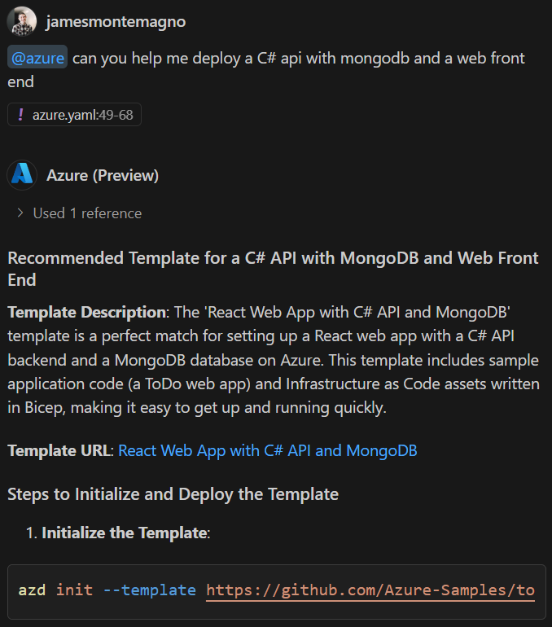

# GitHub Copilot for Azure を使ったアプリケーションの構築とデプロイ

このモジュールはモジュール 1 の続編であり、GitHub Copilot for Azure Preview を使用して Azure に新しいウェブサイトを作成しデプロイするためのステップバイステップガイドを提供します。

GitHub Copilot for Azure を開発およびデプロイワークフローにシームレスに統合するアプローチを紹介します。

## 前提条件

[モジュール 1 - GitHub Copilot for Azure の使い方を始める](./01-Getting-Started-with-GitHub-Copilot-for-Azure.md) を完了していること

## GitHub Copilot for Azure Preview を使用してウェブサイトを作成しデプロイする

1. GitHub リポジトリのローカルクローンを作成できるように、ローカルコンピュータ上に新しいフォルダーを作成します。
    1. VS Code で **File** をクリックし、「Open Folder」を選択します。
    1. **Open Folder** ダイアログボックスで **New Folder** をクリックし、フォルダーに名前を付けて選択し、次に **Select Folder** をクリックします。

1. VS Code が **このフォルダー内のファイルの作成者を信頼しますか？** と尋ねてきます。
    1. **Yes, I trust the authors** をクリックします。

1. Visual Studio Code で **View** > **Terminal** を選択します。ターミナルペインで新しいフォルダーに移動します。

1. ステータスバーで **Chat** (GitHub) アイコンを選択してチャットペインを開きます。

1. ペインのタイトルバーにあるプラスアイコン (**+**) を選択して新しいチャットセッションを開始します。

   

> 前のモジュールの後に GitHub Copilot Chat を閉じた場合は、VS Code 画面の右下にあるステータスバーの GitHub アイコンをクリックします。そして、オプションメニューで **"GitHub Copilot Chat"** を選択します。
>
> 

6. チャットテキストボックスに次のプロンプトを入力し、**Send** (紙飛行機アイコン) を選択するか、キーボードで Enter を押します。

   ```prompt
   @azure can you help me deploy a C# api with mongodb and a web front end?
   ```

    > **IMPORTANT**  
GitHub Copilot for Azure の回答は、大規模言語モデルが応答を生成する方法の特性上、毎回異なる正確な表現になる可能性があります。

   少し待つと、GitHub Copilot for Azure はおそらく `azd` template to use.  Or in some cases will provide an answer like the following:

    

    Just Remember that the Large Language Model will understand what you tell it.  Therefore, just have the conversation with it.

1. If the answer provides a command that begins with `azd init` in a code fence, hover over the code fence to reveal a small pop-up action menu.

    

    Select **Insert into Terminal** to insert the command into the terminal.

    

1. Before you run the `azd init` コマンドを提案します。このコマンドがローカルコンピュータや Azure サブスクリプションにどのような影響を与えるかについて質問したくなるかもしれません。

   次のプロンプトを使用します：

   ```prompt
   @azure Before I execute azd init, what does it do?
   ```

   次のようなスクリーンショットに似た回答が表示される可能性があります。

   

1. `azd` テンプレートについてさらに学ぶには、次のプロンプトを使用します：

   ```prompt
   @azure What resources are created with this template?
   ```

   次のようなスクリーンショットに似た回答が表示される可能性があります。

    

1. テンプレートで使用されるサービスについて質問するには、次のようなプロンプトを使用します：

   ```prompt
   @azure What are the capabilities of Azure App Service?
   ```

   次のようなスクリーンショットに似た回答が表示される可能性があります。

    

1. 納得できたら、ターミナルで次のコマンドを実行して `azd init` command in the terminal. Answer its prompts. If you're unsure what to answer for a prompt, ask GitHub Copilot for Azure for help.

1. Before you can continue, you must authenticate the `azd` ツールを実行します：

    ```cmd
    azd auth login
    ```

    1. ブラウザが開き、Azure に認証する必要があります。同じ資格情報を選択してください。

1. 新しいプロジェクトが初期化され、Azure に認証が完了したら、**azd up** コマンドを使用してアプリケーションをサブスクリプションにデプロイします。ターミナルで、元のプロンプトの返信に従ってコマンドを実行します。

    ```
    azd up
    ```

1. `azd up` コマンドは、サブスクリプションに関する情報やリソースのデプロイ先などについて尋ねます。

    どう答えるべきかわからない場合は、GitHub Copilot for Azure に助けを求めることができます。たとえば、次のように尋ねるかもしれません：

    ```prompt
    @azure azd up is asking me what location I want to deploy the website into. How should I respond?
    ```

    次のようなスクリーンショットに似た回答が表示される可能性があります。

    

5. `azd up`. Ask GitHub Copilot for Azure questions as needed.

    1. When asked the location select **Canada East (canadaeast)**.

    Depending on the `azd` template that you're deploying and the location that you selected, the template might take 10 minutes (or more) to deploy. But we can Move on to [Module 3](./03-Get-Answers-to-your-Questions-about-Azure-Services-and-Resources.md) while it completes

1. If `azd up` experiences an error, ask GitHub Copilot for Azure about the error and how you can resolve it.

    > **TIP**
    > For an easy way to attach the last terminal command results, use the paperclip icon at the bottom left of the chat pane. GitHub Copilot for Azure doesn't know the terminal command results unless they are copy/pasted or attached via the paperclip.


1. When you are done run `azd down` のプロンプトに答え続けて、すべてのリソースを削除します。

**免責事項**:  
この文書は、機械ベースのAI翻訳サービスを使用して翻訳されています。正確性を追求しておりますが、自動翻訳には誤りや不正確な部分が含まれる可能性があることをご了承ください。原文（元の言語で記載された文書）が公式かつ信頼できる情報源とみなされるべきです。重要な情報については、専門の人間による翻訳をお勧めします。この翻訳の使用に起因する誤解や誤った解釈について、当社は一切の責任を負いません。