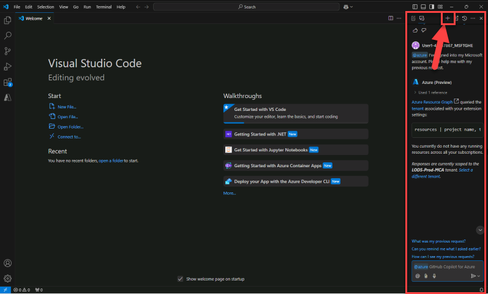

# GitHub Copilot for Azure를 사용하여 애플리케이션 빌드 및 배포하기

이 모듈은 모듈 1의 연속이며, GitHub Copilot for Azure Preview를 사용해 Azure에 새 웹사이트를 생성하고 배포하는 단계별 가이드를 제공합니다.

GitHub Copilot for Azure를 개발 및 배포 워크플로우에 원활히 통합하는 방법을 강조합니다.

## 사전 요구 사항

[모듈 1 - GitHub Copilot for Azure 시작하기](./01-Getting-Started-with-GitHub-Copilot-for-Azure.md) 완료

## GitHub Copilot for Azure Preview를 사용하여 웹사이트 생성 및 배포하기

1. GitHub 저장소의 로컬 복제본을 생성할 수 있는 새 폴더를 로컬 컴퓨터에 만드세요.
    1. VS Code에서 **파일**을 클릭한 후 **폴더 열기**를 선택합니다.
    1. **폴더 열기** 대화 상자에서 **새 폴더**를 클릭하고 폴더에 이름을 지정한 후 선택하고 **폴더 선택**을 클릭합니다.

1. VS Code가 **이 폴더의 파일 작성자를 신뢰하십니까?**를 묻습니다.
    1. **예, 작성자를 신뢰합니다**를 클릭합니다.

1. Visual Studio Code에서 **보기** > **터미널**을 선택합니다. 터미널 창에서 새 폴더로 이동합니다.

1. 상태 표시줄에서 **Chat** (GitHub) 아이콘을 선택하여 채팅 창을 엽니다.

1. 창의 제목 표시줄에서 플러스 아이콘(**+**)을 선택하여 새 채팅 세션을 시작합니다.

   

> 이전 모듈 이후 GitHub Copilot Chat을 닫았다면, VS Code 화면의 오른쪽 하단 상태 표시줄에서 GitHub 아이콘을 클릭하세요. 그리고 옵션 메뉴에서 **GitHub Copilot Chat**을 선택하세요.
>
> 

6. 채팅 텍스트 상자에 다음 프롬프트를 입력하세요. 그런 다음 **보내기**(종이비행기 아이콘)를 선택하거나 키보드에서 Enter를 누릅니다.

   ```prompt
   @azure can you help me deploy a C# api with mongodb and a web front end?
   ```

    > **중요**
GitHub Copilot for Azure가 응답을 생성하는 방식 때문에, 응답의 정확한 문구는 매번 다를 수 있습니다.

   잠시 후, GitHub Copilot for Azure가 `azd` template to use.  Or in some cases will provide an answer like the following:

    

    Just Remember that the Large Language Model will understand what you tell it.  Therefore, just have the conversation with it.

1. If the answer provides a command that begins with `azd init` in a code fence, hover over the code fence to reveal a small pop-up action menu.

    

    Select **Insert into Terminal** to insert the command into the terminal.

    

1. Before you run the `azd init` 명령을 제안할 가능성이 높습니다. 이 명령이 로컬 컴퓨터와 Azure 구독에 어떤 영향을 미치는지 궁금할 수 있습니다.

   다음 프롬프트를 사용하세요:

   ```prompt
   @azure Before I execute azd init, what does it do?
   ```

   아래와 유사한 응답을 볼 수 있습니다.

   

1. `azd` 템플릿에 대해 더 알아보려면 다음 프롬프트를 사용하세요:

   ```prompt
   @azure What resources are created with this template?
   ```

   아래와 유사한 응답을 볼 수 있습니다.

    

1. 템플릿이 사용하는 서비스에 대해 질문하려면 다음과 같은 프롬프트를 사용하세요:

   ```prompt
   @azure What are the capabilities of Azure App Service?
   ```

   아래와 유사한 응답을 볼 수 있습니다.

    

1. 만족스러운 답변을 얻었다면, 터미널에서 다음 명령을 실행하여 `azd init` command in the terminal. Answer its prompts. If you're unsure what to answer for a prompt, ask GitHub Copilot for Azure for help.

1. Before you can continue, you must authenticate the `azd` 도구를 실행하세요:

    ```cmd
    azd auth login
    ```

    1. 브라우저가 열리며 Azure에 인증을 요구합니다. 이전과 동일한 자격 증명을 선택하세요.

1. 새 프로젝트가 초기화되고 Azure에 인증한 후, **azd up** 명령을 사용하여 애플리케이션을 구독에 배포하세요. 터미널에서 원래 프롬프트 응답의 지침에 따라 명령을 실행하세요.

    ```
    azd up
    ```

1. `azd up` 명령은 구독, 리소스를 배포할 위치 등에 대한 정보를 요청합니다.

    어떻게 대답해야 할지 확신이 없다면 GitHub Copilot for Azure에 도움을 요청할 수 있습니다. 예를 들어, 다음과 같이 질문할 수 있습니다:

    ```prompt
    @azure azd up is asking me what location I want to deploy the website into. How should I respond?
    ```

    아래와 유사한 응답을 볼 수 있습니다.

    

5. `azd up`. Ask GitHub Copilot for Azure questions as needed.

    1. When asked the location select **Canada East (canadaeast)**.

    Depending on the `azd` template that you're deploying and the location that you selected, the template might take 10 minutes (or more) to deploy. But we can Move on to [Module 3](./03-Get-Answers-to-your-Questions-about-Azure-Services-and-Resources.md) while it completes

1. If `azd up` experiences an error, ask GitHub Copilot for Azure about the error and how you can resolve it.

    > **TIP**
    > For an easy way to attach the last terminal command results, use the paperclip icon at the bottom left of the chat pane. GitHub Copilot for Azure doesn't know the terminal command results unless they are copy/pasted or attached via the paperclip.


1. When you are done run `azd down` 명령의 프롬프트에 계속 응답하여 모든 리소스를 제거하세요.

**면책 조항**:  
이 문서는 AI 기반 기계 번역 서비스를 사용하여 번역되었습니다. 정확성을 위해 최선을 다하고 있지만, 자동 번역에는 오류나 부정확성이 포함될 수 있습니다. 원본 문서의 해당 언어 버전이 권위 있는 자료로 간주되어야 합니다. 중요한 정보에 대해서는 전문적인 인간 번역을 권장합니다. 이 번역 사용으로 인해 발생하는 오해나 잘못된 해석에 대해 당사는 책임을 지지 않습니다.