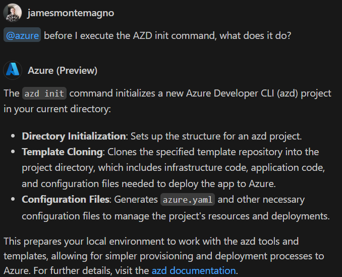
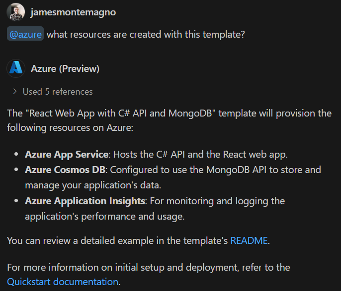

# Construa e implante sua aplicação com o GitHub Copilot para Azure

Este módulo é uma continuação do módulo 1 e fornece um guia passo a passo sobre como usar o GitHub Copilot para Azure Preview para criar e implantar um novo site no Azure.

Ele destaca uma abordagem para integrar de forma fluida o GitHub Copilot para Azure no seu fluxo de trabalho de desenvolvimento e implantação.

## Pré-requisitos

Concluir o [Módulo 1 - Introdução ao uso do GitHub Copilot para Azure](./01-Getting-Started-with-GitHub-Copilot-for-Azure.md)

## Criar e implantar um site usando o GitHub Copilot para Azure Preview

1. Crie uma nova pasta no seu computador local onde você possa criar um clone local de um repositório do GitHub.
    1. No VS Code, clique em **Arquivo**, depois em "Abrir Pasta".
    1. Na caixa de diálogo **Abrir Pasta**, clique em **Nova Pasta**, dê um nome à pasta, selecione-a e clique em **Selecionar Pasta**.

1. O VS Code perguntará: **Você confia nos autores dos arquivos nesta pasta?**
    1. Clique em **Sim, confio nos autores**.

1. No Visual Studio Code, selecione **Exibir** > **Terminal**. No painel do terminal, vá para a nova pasta.

1. Na barra de status, selecione o ícone **Chat** (GitHub) para abrir o painel de chat.

1. Inicie uma nova sessão de chat selecionando o ícone de mais (**+**) na barra de título do painel.

   

> Se você fechou o GitHub Copilot Chat após o último módulo, clique no ícone do GitHub na barra de status, no canto inferior direito da tela do VS Code. E selecione **"GitHub Copilot Chat"** no menu de opções.
>
> 

6. Na caixa de texto do chat, digite o seguinte prompt. Em seguida, selecione **Enviar** (ícone de avião de papel) ou pressione Enter no teclado.

   ```prompt
   @azure can you help me deploy a C# api with mongodb and a web front end?
   ```

    > **IMPORTANTE**
    A redação exata da resposta pode variar a cada vez que o GitHub Copilot para Azure responde, devido à forma como os modelos de linguagem geram respostas.

   Após alguns instantes, o GitHub Copilot para Azure provavelmente sugerirá um comando `azd` template to use.  Or in some cases will provide an answer like the following:

    

    Just Remember that the Large Language Model will understand what you tell it.  Therefore, just have the conversation with it.

1. If the answer provides a command that begins with `azd init` in a code fence, hover over the code fence to reveal a small pop-up action menu.

    

    Select **Insert into Terminal** to insert the command into the terminal.

    

1. Before you run the `azd init`. Você pode ter dúvidas sobre como isso afeta seu computador local e sua assinatura do Azure.

   Use o seguinte prompt:

   ```prompt
   @azure Before I execute azd init, what does it do?
   ```

   Você pode ver uma resposta semelhante à captura de tela a seguir.

   

1. Use o seguinte prompt para saber mais sobre o modelo `azd`:

   ```prompt
   @azure What resources are created with this template?
   ```

   Você pode ver uma resposta semelhante à captura de tela a seguir.

    

1. Faça perguntas sobre os serviços que o modelo utiliza com um prompt como:

   ```prompt
   @azure What are the capabilities of Azure App Service?
   ```

   Você pode ver uma resposta semelhante à captura de tela a seguir.

    

1. Quando estiver satisfeito, execute a ferramenta `azd init` command in the terminal. Answer its prompts. If you're unsure what to answer for a prompt, ask GitHub Copilot for Azure for help.

1. Before you can continue, you must authenticate the `azd` no terminal com o seguinte comando:

    ```cmd
    azd auth login
    ```

    1. Isso abrirá um navegador que exigirá que você autentique no Azure. Selecione as mesmas credenciais usadas anteriormente.

1. Depois que o novo projeto for inicializado e você tiver autenticado no Azure, use o comando **azd up** para implantar a aplicação na sua assinatura. No terminal, execute o comando conforme as instruções na resposta do prompt original.

    ```
    azd up
    ```

1. O comando `azd up` solicitará informações sobre sua assinatura, onde implantar os recursos e mais.

    Se você não souber como responder, pode pedir ajuda ao GitHub Copilot para Azure. Por exemplo, você pode perguntar:

    ```prompt
    @azure azd up is asking me what location I want to deploy the website into. How should I respond?
    ```

    Você pode ver uma resposta semelhante à captura de tela a seguir.

    

5. Continue respondendo às solicitações do `azd up`. Ask GitHub Copilot for Azure questions as needed.

    1. When asked the location select **Canada East (canadaeast)**.

    Depending on the `azd` template that you're deploying and the location that you selected, the template might take 10 minutes (or more) to deploy. But we can Move on to [Module 3](./03-Get-Answers-to-your-Questions-about-Azure-Services-and-Resources.md) while it completes

1. If `azd up` experiences an error, ask GitHub Copilot for Azure about the error and how you can resolve it.

    > **TIP**
    > For an easy way to attach the last terminal command results, use the paperclip icon at the bottom left of the chat pane. GitHub Copilot for Azure doesn't know the terminal command results unless they are copy/pasted or attached via the paperclip.


1. When you are done run `azd down` para remover todos os recursos.

**Aviso Legal**:  
Este documento foi traduzido utilizando serviços de tradução baseados em IA. Embora nos esforcemos para garantir a precisão, esteja ciente de que traduções automáticas podem conter erros ou imprecisões. O documento original em seu idioma nativo deve ser considerado a fonte oficial. Para informações críticas, recomenda-se a tradução humana profissional. Não nos responsabilizamos por quaisquer mal-entendidos ou interpretações equivocadas decorrentes do uso desta tradução.