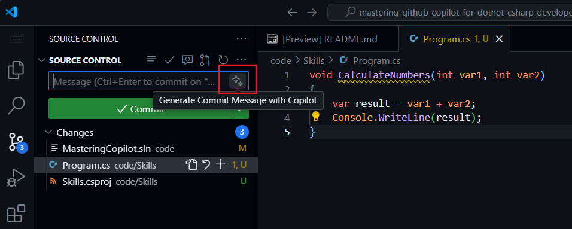

## 第 2 步：在 C# 文件中查看 AI 代碼建議！

_做得好！🎉 你使用包含 Copilot 安裝的 devcontainer 文件創建了一個 Codespace！_

GitHub Copilot 提供了對多種語言和框架的建議，特別是對 Python、JavaScript、TypeScript、Ruby、Go、C# 和 C++ 表現尤為出色。以下示例使用 C#，但其他語言的操作方式類似。

讓我們試試在 C# 中使用 Copilot。

> **Note**:
> 如果你已經關閉了之前的 Codespace，請重新打開它或創建一個新的 Codespace。

### ⌨️ 活動：新增一個 C# 文件並開始編寫代碼

> **Note**:
> 請確保打開 **Solution Explorer**，以便查看有組織的視圖，方便添加新項目並運行它們。

1. 使用 `.NET: New Project...` 命令創建一個新的 .NET 項目，並選擇 `Console App`。
2. 選擇 **code** 資料夾，並將項目命名為 **Skills**。
3. 打開 `Program.cs`。
4. 確認你的新文件看起來如下：
   

5. 在 `Program.cs` 文件中，移除任何代碼，然後輸入以下函數頭。

   ```csharp
   void CalculateNumbers(int var1, int var2)
   {
   ```

   GitHub Copilot 將自動以灰色文字建議整個函數主體。以下是你很可能會看到的建議示例，但具體建議可能會有所不同。
   

6. 按下 `Tab` 鍵接受建議。

### ⌨️ 活動：從 Codespace 將代碼推送到你的儲存庫

讓我們使用 GitHub Copilot 總結我們的更改，然後提交代碼。

1. 打開 **Source Control** 標籤。
2. 點擊 **Message** 條目中的 ✨ 按鈕，讓 Copilot 生成你的提交訊息。



3. 點擊 **Commit** 按鈕。

前往 [練習的第 3 部分](./3-copilot-hub.md)。

**免責聲明**：  
本文件是使用基於機器的人工智能翻譯服務進行翻譯的。我們致力於確保準確性，但請注意，自動翻譯可能包含錯誤或不準確之處。應以原文文件為權威來源。對於關鍵信息，建議尋求專業人工翻譯。我們對因使用本翻譯而產生的任何誤解或錯誤解讀概不負責。