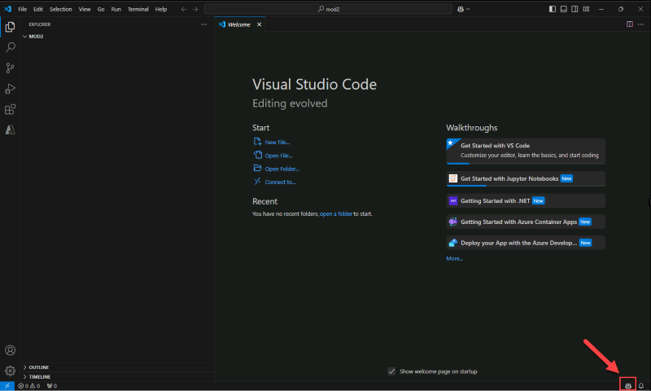

# 使用 GitHub Copilot for Azure 建置並部署您的應用程式

本模組是模組 1 的延續，提供了使用 GitHub Copilot for Azure Preview 在 Azure 中建立並部署新網站的分步指南。

它展示了一種將 GitHub Copilot for Azure 無縫整合到您的開發與部署工作流程中的方法。

## 先決條件

完成 [模組 1 - 開始使用 GitHub Copilot for Azure](./01-Getting-Started-with-GitHub-Copilot-for-Azure.md)

## 使用 GitHub Copilot for Azure Preview 建立並部署網站

1. 在您的本機電腦上建立一個新資料夾，用來建立 GitHub 儲存庫的本機複製。
    1. 在 VS Code 中，點擊 **File**，然後選擇 "Open Folder"
    1. 在 **Open Folder** 對話框中，點擊 **New Folder**，為資料夾命名，選取它，然後點擊 **Select Folder**

1. VS Code 會詢問您 **Do you trust the Authors of the files in this folder?**
    1. 點擊 **Yes, I trust the authors**

1. 在 Visual Studio Code 中，選擇 **View** > **Terminal**。在終端面板中，進入新資料夾。

1. 在狀態列上，選擇 **Chat** (GitHub) 圖示以打開聊天面板。

1. 在面板標題列上，選擇加號圖示 (**+**) 開啟新的聊天會話。

   

> 如果您在上一個模組後關閉了 GitHub Copilot Chat，請點擊 VS Code 畫面右下角的狀態列中的 GitHub 圖示。然後在選單中選擇 **"GitHub Copilot Chat"**。
>
> 

6. 在聊天文字框中，輸入以下提示。然後點擊 **Send**（紙飛機圖示）或按下鍵盤上的 Enter。

   ```prompt
   @azure can you help me deploy a C# api with mongodb and a web front end?
   ```

    > **IMPORTANT**
    每次 GitHub Copilot for Azure 回應時，由於大型語言模型生成回應的方式不同，具體的回應內容可能有所差異。

   過了一會兒，GitHub Copilot for Azure 可能會建議一個 `azd` template to use.  Or in some cases will provide an answer like the following:

    

    Just Remember that the Large Language Model will understand what you tell it.  Therefore, just have the conversation with it.

1. If the answer provides a command that begins with `azd init` in a code fence, hover over the code fence to reveal a small pop-up action menu.

    

    Select **Insert into Terminal** to insert the command into the terminal.

    

1. Before you run the `azd init` 命令，您可能會對它如何影響您的本機電腦和 Azure 訂閱感到疑惑。

   使用以下提示：

   ```prompt
   @azure Before I execute azd init, what does it do?
   ```

   您可能會看到類似以下截圖的回應。

   

1. 使用以下提示來了解更多關於 `azd` 範本的信息：

   ```prompt
   @azure What resources are created with this template?
   ```

   您可能會看到類似以下截圖的回應。

    

1. 使用類似以下的提示詢問範本使用的服務：

   ```prompt
   @azure What are the capabilities of Azure App Service?
   ```

   您可能會看到類似以下截圖的回應。

    

1. 當您滿意時，透過在終端執行以下命令來運行 `azd init` command in the terminal. Answer its prompts. If you're unsure what to answer for a prompt, ask GitHub Copilot for Azure for help.

1. Before you can continue, you must authenticate the `azd` 工具：

    ```cmd
    azd auth login
    ```

    1. 這將打開瀏覽器，要求您驗證 Azure，選擇與之前相同的憑據。

1. 一旦新專案初始化完成，並且您已經驗證 Azure，使用 **azd up** 命令將應用程式部署到您的訂閱。在終端中，根據原始提示的回應執行命令。

    ```
    azd up
    ```

1. `azd up` 命令會詢問有關您的訂閱、資源部署位置等資訊。

    如果您不確定如何回答，您可以向 GitHub Copilot for Azure 尋求幫助。例如，您可以詢問：

    ```prompt
    @azure azd up is asking me what location I want to deploy the website into. How should I respond?
    ```

    您可能會看到類似以下截圖的回應。

    

5. 繼續回應來自 `azd up`. Ask GitHub Copilot for Azure questions as needed.

    1. When asked the location select **Canada East (canadaeast)**.

    Depending on the `azd` template that you're deploying and the location that you selected, the template might take 10 minutes (or more) to deploy. But we can Move on to [Module 3](./03-Get-Answers-to-your-Questions-about-Azure-Services-and-Resources.md) while it completes

1. If `azd up` experiences an error, ask GitHub Copilot for Azure about the error and how you can resolve it.

    > **TIP**
    > For an easy way to attach the last terminal command results, use the paperclip icon at the bottom left of the chat pane. GitHub Copilot for Azure doesn't know the terminal command results unless they are copy/pasted or attached via the paperclip.


1. When you are done run `azd down` 的提示，以移除所有資源。

**免責聲明**:  
本文件是使用基於機器的人工智能翻譯服務進行翻譯的。儘管我們努力確保準確性，但請注意，自動翻譯可能包含錯誤或不準確之處。應以原始語言的文件作為權威來源。對於關鍵信息，建議尋求專業人工翻譯。我們對因使用此翻譯而引起的任何誤解或誤讀概不負責。