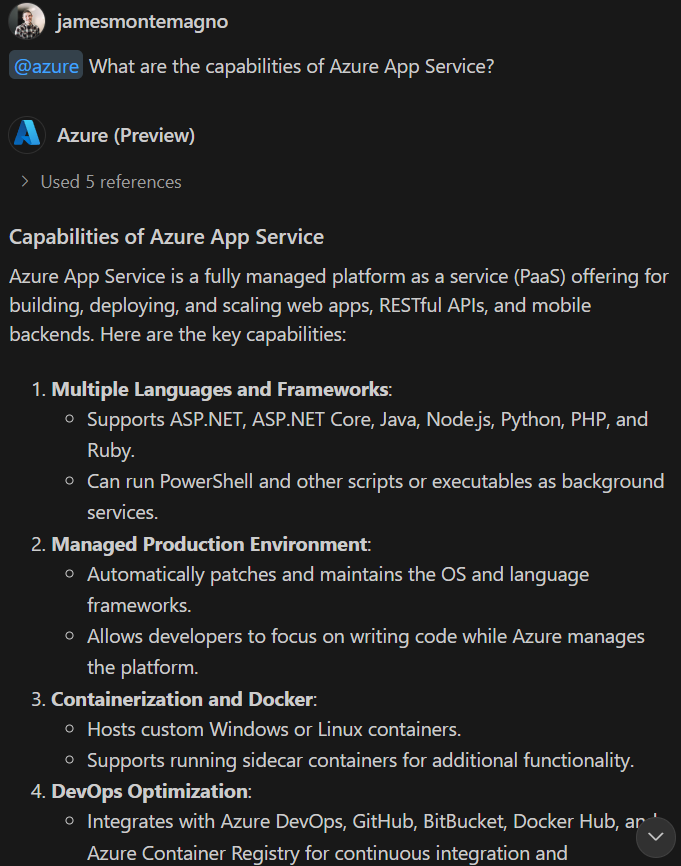
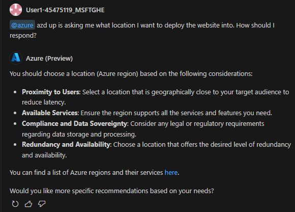

# Xây dựng và triển khai ứng dụng của bạn với GitHub Copilot for Azure

Phần này là tiếp nối của module 1 và cung cấp hướng dẫn từng bước về cách sử dụng GitHub Copilot for Azure Preview để tạo và triển khai một trang web mới trên Azure.

Nó nhấn mạnh cách tích hợp liền mạch GitHub Copilot for Azure vào quy trình phát triển và triển khai của bạn.

## Yêu cầu

Hoàn thành [Module 1 - Bắt đầu sử dụng GitHub Copilot for Azure](./01-Getting-Started-with-GitHub-Copilot-for-Azure.md)

## Tạo và triển khai một trang web bằng GitHub Copilot for Azure Preview

1. Tạo một thư mục mới trên máy tính của bạn để tạo một bản sao cục bộ của kho lưu trữ GitHub.
    1. Trong VS Code, nhấn **File**, sau đó chọn "Open Folder".
    1. Trong hộp thoại **Open Folder**, nhấn **New Folder**, đặt tên cho thư mục, chọn thư mục đó, sau đó nhấn **Select Folder**.

1. VS Code sẽ hỏi bạn **Do you trust the Authors of the files in this folder?**
    1. Nhấn **Yes, I trust the authors**.

1. Trong Visual Studio Code, chọn **View** > **Terminal**. Trong khung terminal, chuyển đến thư mục mới.

1. Trên thanh trạng thái, chọn biểu tượng **Chat** (GitHub) để mở khung chat.

1. Bắt đầu một phiên chat mới bằng cách chọn biểu tượng dấu cộng (**+**) trên thanh tiêu đề của khung.

   

> Nếu bạn đã đóng GitHub Copilot Chat sau module trước, nhấn vào biểu tượng GitHub trên thanh trạng thái ở góc dưới bên phải màn hình VS Code của bạn. Sau đó chọn **"GitHub Copilot Chat"** trong menu tùy chọn.
>
> 

6. Trong hộp văn bản chat, nhập prompt sau. Sau đó nhấn **Send** (biểu tượng máy bay giấy) hoặc nhấn Enter trên bàn phím của bạn.

   ```prompt
   @azure can you help me deploy a C# api with mongodb and a web front end?
   ```

    > **IMPORTANT**
Câu trả lời chính xác sẽ khác nhau mỗi lần GitHub Copilot for Azure trả lời, do cách các mô hình ngôn ngữ lớn tạo ra phản hồi.

   Sau một lúc, GitHub Copilot for Azure có thể gợi ý lệnh `azd` template to use.  Or in some cases will provide an answer like the following:

    

    Just Remember that the Large Language Model will understand what you tell it.  Therefore, just have the conversation with it.

1. If the answer provides a command that begins with `azd init` in a code fence, hover over the code fence to reveal a small pop-up action menu.

    

    Select **Insert into Terminal** to insert the command into the terminal.

    

1. Before you run the `azd init`, bạn có thể thắc mắc về cách lệnh này ảnh hưởng đến máy tính cục bộ và tài khoản Azure của bạn.

   Sử dụng prompt sau:

   ```prompt
   @azure Before I execute azd init, what does it do?
   ```

   Bạn có thể thấy một câu trả lời giống như ảnh chụp màn hình sau.

   

1. Sử dụng prompt sau để tìm hiểu thêm về mẫu `azd`:

   ```prompt
   @azure What resources are created with this template?
   ```

   Bạn có thể thấy một câu trả lời giống như ảnh chụp màn hình sau.

    

1. Đặt câu hỏi về các dịch vụ mà mẫu sử dụng với một prompt như:

   ```prompt
   @azure What are the capabilities of Azure App Service?
   ```

   Bạn có thể thấy một câu trả lời giống như ảnh chụp màn hình sau.

    

1. Khi bạn đã hài lòng, chạy công cụ `azd init` command in the terminal. Answer its prompts. If you're unsure what to answer for a prompt, ask GitHub Copilot for Azure for help.

1. Before you can continue, you must authenticate the `azd` bằng cách chạy lệnh sau trong terminal:

    ```cmd
    azd auth login
    ```

    1. Lệnh này sẽ mở một trình duyệt yêu cầu bạn xác thực vào Azure. Chọn thông tin đăng nhập giống như trước đó.

1. Sau khi dự án mới được khởi tạo và bạn đã xác thực vào Azure, sử dụng lệnh **azd up** để triển khai ứng dụng vào tài khoản của bạn. Trong terminal, chạy lệnh theo hướng dẫn trong phản hồi của prompt ban đầu.

    ```
    azd up
    ```

1. Lệnh `azd up` sẽ yêu cầu thông tin về tài khoản, vị trí triển khai tài nguyên, và các thông tin khác.

    Nếu bạn không chắc chắn cách trả lời, bạn có thể hỏi GitHub Copilot for Azure để được trợ giúp. Ví dụ, bạn có thể hỏi:

    ```prompt
    @azure azd up is asking me what location I want to deploy the website into. How should I respond?
    ```

    Bạn có thể thấy một câu trả lời giống như ảnh chụp màn hình sau.

    

5. Tiếp tục trả lời các prompt từ `azd up`. Ask GitHub Copilot for Azure questions as needed.

    1. When asked the location select **Canada East (canadaeast)**.

    Depending on the `azd` template that you're deploying and the location that you selected, the template might take 10 minutes (or more) to deploy. But we can Move on to [Module 3](./03-Get-Answers-to-your-Questions-about-Azure-Services-and-Resources.md) while it completes

1. If `azd up` experiences an error, ask GitHub Copilot for Azure about the error and how you can resolve it.

    > **TIP**
    > For an easy way to attach the last terminal command results, use the paperclip icon at the bottom left of the chat pane. GitHub Copilot for Azure doesn't know the terminal command results unless they are copy/pasted or attached via the paperclip.


1. When you are done run `azd down` để xóa tất cả tài nguyên.

**Tuyên bố miễn trừ trách nhiệm**:  
Tài liệu này đã được dịch bằng các dịch vụ dịch thuật AI tự động. Mặc dù chúng tôi cố gắng đảm bảo độ chính xác, xin lưu ý rằng các bản dịch tự động có thể chứa lỗi hoặc sự không chính xác. Tài liệu gốc bằng ngôn ngữ nguyên bản nên được coi là nguồn tham khảo chính thức. Đối với các thông tin quan trọng, khuyến nghị sử dụng dịch vụ dịch thuật chuyên nghiệp từ con người. Chúng tôi không chịu trách nhiệm cho bất kỳ sự hiểu lầm hoặc diễn giải sai nào phát sinh từ việc sử dụng bản dịch này.